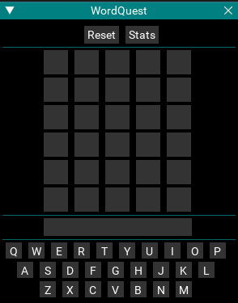
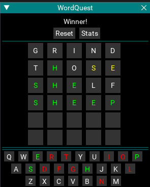
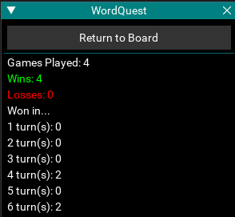

# wordquest

A Wordle clone in Lua

# Instructions

- Clone the repo or download the files and move all 3 files into your MacroQuest Lua folder.

Run it with /lua run wordquest

# Rules

Try to guess the word. You get 6 tries.
Yellow letters are letters which exist in the word, but not in that position.
Green letters are letters which exist in the word and are in the correct position.
Red letters are letters which have been used and are not a part of the word.
